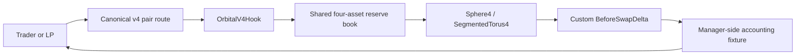
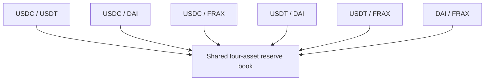
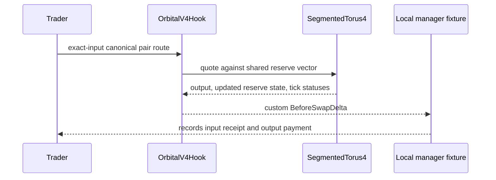

# Orbital

> **One reserve book for four stablecoins.**

Orbital is an experimental Uniswap v4 hook that applies bounded Orbital sphere and torus geometry to a shared stablecoin reserve book. In this prototype, USDC, USDT, DAI, and FRAX are represented by mock assets; their six canonical pair routes all advance the same four-asset state rather than splitting liquidity across six independent pools.

The project explores what concentrated multi-asset liquidity can look like when a pairwise swap is priced against one basket. It is not a production exchange, a deployed protocol, or a guarantee of stablecoin safety.

> [!WARNING]
> **Prototype only.** This repository is experimental, unaudited, and intended for mock/test environments. No verified public deployment or public settlement interface is configured. Do not use it with real funds.

## The idea

Four stablecoins create six pair routes. In a conventional pair-per-pool design, each route can fragment capital from the others. Orbital instead exposes those routes through one logical reserve book: a USDC/DAI trade and a USDT/FRAX trade both affect the same aggregate state.

The implementation fixes the demo to four assets and uses bounded geometry. It supports exact-input routes, a limited set of tick transitions, range-local LP accounting, and a Uniswap v4 `beforeSwap` adapter. It does **not** yet implement a general N-asset production pool, public router, ERC-20 custody flow, or live PoolManager settlement.



## Mathematical model

Orbital is informed by Paradigm's Orbital research. The reference geometry permits an asset count `n >= 2`; the Solidity prototype deliberately fixes `n = 4`, where `sqrt(n) = 2` exactly in WAD arithmetic.

### Sphere branch

For normalized reserves `xᵢ` and a positive radius `r`, the nonnegative-price sphere branch is:

```text
Σ (r - xᵢ)² = r²,     0 ≤ xᵢ ≤ r
```

At the equal-price point, each four-asset coordinate is `q = r / 2`. The prototype normalizes token amounts to WAD, rejects overflow, rounds required inputs up, and rounds token payouts down. Normalization is accounting machinery—not a price oracle or a promise that an asset holds its peg.

### Tick planes and the aggregate torus

A tick is represented by a plane `α = k`, where `α = Σxᵢ / sqrt(n)`. Interior and boundary ranges combine into the fixed-partition aggregate invariant:

```text
(α_total - k_boundary - r_interior·sqrt(n))²
  + (||w|| - s_boundary)²
= r_interior²
```

`SegmentedTorus4` solves this bounded model by locating the next tick crossing, applying the partial transition, rebuilding the aggregate state, then continuing with remaining exact-input flow. The current implementation allows at most 16 configured ranges and 8 status transitions per swap; all-boundary continuation deliberately reverts rather than performing a partial settlement.

For derivations, rounding conventions, and unsupported branches, read the [protocol specification](docs/SPECIFICATION.md). The independent [Python reference guide](reference/README.md) describes the decimal model separately from Solidity's fixed-point implementation.

## What is implemented

| Capability | Current prototype behavior |
| --- | --- |
| Shared routing | Six canonical routes across USDC, USDT, DAI, and FRAX advance one logical reserve book. |
| Geometry | `Sphere4`, `Torus4`, and `SegmentedTorus4` provide bounded four-asset geometry, fixed-partition quotes, and tick trap/recovery transitions. |
| Swap domain | Canonical, exact-input pair swaps only; exact-output swaps are rejected. |
| v4 adapter | `beforeSwap` accepts configured routes and returns the official custom `BeforeSwapDelta` that replaces the concentrated-liquidity leg. |
| LP accounting | Range-local inventory attribution, proportional share accounting, fee checkpoints, and explicit non-redeemable rounding dust. |
| Independent models | A Decimal Python reference and dependency-free browser `BigInt` simulator replay the bounded transition logic. |

### One basket, six routes



The pair interface chooses two assets from the basket; it does not own a separate liquidity allocation. The local manager fixture verifies the per-currency custom-delta accounting legs across routes, but it neither initializes real pools nor transfers ERC-20 balances.

## Architecture and boundaries



The adapter checks canonical currency ordering, pair membership, the configured hook, fee, tick spacing, and callback authorization before state mutation. All `IHooks` callbacks other than `beforeSwap` explicitly revert.

The following are intentionally outside the current implementation boundary:

- Production PoolManager settlement, token custody, and public router or position-manager interfaces.
- Generic asset counts, exact-output swaps, single-token LP entry, fee-on-transfer tokens, and rebasing tokens.
- All-boundary continuation, finalized fixed-point error policy, fee-rate governance, and live deployment claims.
- Any assurance that a stablecoin depeg is harmless or that LP capital is protected.

The fuller list of obligations and safety limits lives in [the specification](docs/SPECIFICATION.md#failure-policy-and-unresolved-obligations) and [release notes](docs/RELEASE.md).

## Quick start

### Requirements

- Foundry `v1.7.1`
- Python `3.14.6`
- Node.js, Git, and Make

Clone recursively so the pinned Uniswap v4-core dependency is available:

```sh
git clone --recurse-submodules https://github.com/Sarnav07/Orbital.git
cd Orbital
```

Run the complete local validation suite:

```sh
make check
```

This checks Solidity formatting, builds the contracts, reports bytecode sizes, runs Foundry tests, runs the independent Python reference tests, and runs the simulator tests.

Run the extended Foundry fuzz profile with:

```sh
cd contracts
FOUNDRY_PROFILE=ci forge test -vv
```

### Explore the frontend and simulator

The Vite/React interface presents the protocol narrative and a local, deterministic swap sandbox. It does not connect a wallet or settle swaps on-chain.

```sh
cd app
npm install
npm run dev
```

The browser-native `BigInt` transition replayer and quote engine are available independently:

```sh
cd packages/simulator
npm test
```

See [`packages/simulator/README.md`](packages/simulator/README.md) for its scope and constraints.

## Deployment posture

Unichain Sepolia is a configured target environment, **not** a deployment claim. [`DeployOrbitalHook.s.sol`](contracts/script/DeployOrbitalHook.s.sol) mines a CREATE2 salt from the exact constructor calldata to satisfy the Uniswap v4 permission-address pattern (`beforeSwap` and `beforeSwapReturnDelta`).

The script is a future, separately authorized deployment step. A deployment should not be described as live until it has a chain, transaction hash, source revision, constructor inputs, deployed addresses, and independently refreshed verification evidence.

## References and attribution

- [Paradigm: Orbital](https://www.paradigm.xyz/writing/orbital) — mathematical inspiration for the sphere and tick-boundary model.
- [Uniswap v4-core](https://github.com/Uniswap/v4-core) — pinned interface dependency.

Project code is independently authored. Attribution does not imply code reuse, equivalence to, endorsement by, or affiliation with these projects.

## License

This project is licensed under the [MIT License](LICENSE).
