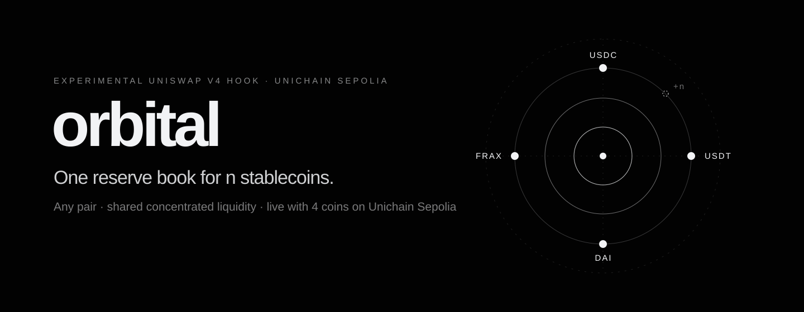

<p align="center">
  
</p>

<p align="center">
  <a href="https://orbital-protocol-mu.vercel.app/app"><strong>Launch app</strong></a> ·
  <a href="https://orbital-protocol-mu.vercel.app/docs">Documentation</a> ·
  <a href="#deployed-contracts">Contract addresses</a>
</p>

**Orbital** is an experimental **Uniswap v4 hook** that trades **n stablecoins through one shared, concentrated reserve book**, using Paradigm's n-dimensional Orbital sphere-and-torus geometry. The deployed instance is a **4-coin book (USDC, USDT, DAI, FRAX) on Unichain Sepolia**.

- **Swap stablecoins** through any pair in the basket: every pair is a v4 pool, six in the 4-coin deployment. Quotes are exact, slippage is bounded and each transaction is wallet-reviewed.
- **Provide liquidity to a range.** Pick how tightly to concentrate around the peg; each range tracks its own inventory and fees.
- **Watch the book live.** Reserves, range states, solvency and recent swaps are read straight from the hook, no wallet required.
- **Stress-test a depeg.** A sandbox model shows which ranges trap, and when, as one coin floods the book.

n(n − 1)/2 pools, one book. A pair-per-pool design needs six pools for four coins and twenty-eight for eight, each funded separately. Orbital keeps one n-asset reserve vector behind all of them, so a USDC/DAI trade and a USDT/FRAX trade move the same state. The curve sets the price; it does not force a 1:1 exchange.

## Our Uniswap v4 hook

We implemented **four hook callbacks**. Together they replace v4's concentrated-liquidity leg with the Orbital curve and keep all custody in the PoolManager:

| Callback | Flag | What we implemented |
| --- | --- | --- |
| `beforeInitialize` | `1 << 13` | Admits only the canonical pair keys for the basket (six for the deployed 4-coin basket; fee 500, tick spacing 60, this hook). |
| `beforeAddLiquidity` | `1 << 11` | Always reverts: native v4 positions cannot attach. Liquidity goes through the hook's range functions. |
| `beforeSwap` | `1 << 7` | Normalizes decimals, charges the fee once on input, prices the trade across up to 8 range crossings, mints input claims and burns output claims. |
| `beforeSwapReturnDelta` | `1 << 3` | Returns `BeforeSwapDelta(+in, −out)`, so the hook's curve fully replaces the pool's swap. |

The flags make the deployed address end in **`0x…2888`**. `hookData = abi.encode(minAmountOut, deadline)` adds optional slippage and deadline guards. The geometry and the Python reference are general n; the Solidity hook fixes n = 4 so that √n = 2 is exact in WAD ([MATH-5](docs/MATH.md#1-per-tick-geometry-and-canonical-coordinates)).

[Hook implementation](contracts/src/OrbitalV4Hook.sol) · [Swap engine](contracts/src/math/SegmentedTorus4.sol) · [Mathematics](docs/MATH.md)

## Built on Unichain

**Unichain Sepolia** hosts the featured pool (Ethereum Sepolia, Arbitrum Sepolia and Arc Testnet run the same pool), and **Uniswap v4's PoolManager holds all custody** as ERC-6909 claims. Swaps settle inside one `unlock`: the router pays the input, the hook takes it as claims and burns the output claims, and anything unsettled reverts the whole transaction. Range deposits, withdrawals and fee collection use the same claim path through the hook's own `unlock` callback.

[Deployment script](contracts/script/DeployOrbitalDemo.s.sol) · [Network configuration](app/src/chain/config.ts)

## Deployed contracts

The same four-coin pool runs on **four testnets**, each with its own hook, router and mock basket, all seeded with about 3.59M of each coin. The app's **Pools** page lists them; pick a network in the app to swap or provide liquidity on it.

| Network | Chain ID | Gas | OrbitalV4Hook | PoolManager | Live swap | Manifest |
| --- | --- | --- | --- | --- | --- | --- |
| **Unichain Sepolia** | `1301` | ETH | [0x10f1…2888](https://unichain-sepolia.blockscout.com/address/0x10f107C223E83C0c3D43f3afe0eD75e0a06B2888) | [0x00B0…62AC](https://unichain-sepolia.blockscout.com/address/0x00B036B58a818B1BC34d502D3fE730Db729e62AC) | [0x23e33f62…](https://unichain-sepolia.blockscout.com/tx/0x23e33f62af47efb078152ae5d8ef18b144f65771b6bc2cf87c7414c353e19e46) | [unichain-sepolia.json](contracts/deployments/unichain-sepolia.json) |
| **Ethereum Sepolia** | `11155111` | ETH | [0xd589…A888](https://sepolia.etherscan.io/address/0xd5892e1AF28A190D223f8b81844A7b7f680eA888) | [0xE03A…3543](https://sepolia.etherscan.io/address/0xE03A1074c86CFeDd5C142C4F04F1a1536e203543) | [0xd98d6022…](https://sepolia.etherscan.io/tx/0xd98d60220999e8420c1f089a816c455e4e224bcf3dabd4a0d80562a247dcc856) | [sepolia.json](contracts/deployments/sepolia.json) |
| **Arbitrum Sepolia** | `421614` | ETH | [0x7E7a…A888](https://sepolia.arbiscan.io/address/0x7E7a96FDB751392d45D2462E0B0B88aCCFefA888) | [0xFB3e…a317](https://sepolia.arbiscan.io/address/0xFB3e0C6F74eB1a21CC1Da29aeC80D2Dfe6C9a317) | [0x27813100…](https://sepolia.arbiscan.io/tx/0x27813100f8e77f6fe5cdde5f3e0eb3f2b22bf9b0852f3aa02779680df1eac764) | [arbitrum-sepolia.json](contracts/deployments/arbitrum-sepolia.json) |
| **Arc Testnet** | `5042002` | USDC | [0x9cd7…6888](https://testnet.arcscan.app/address/0x9cd75cfac54D6969a67009260A49d92c4f016888) | [0x8366…0951](https://testnet.arcscan.app/address/0x8366a39CC670B4001A1121B8F6A443A643e40951) | [0x1f1c293f…](https://testnet.arcscan.app/tx/0x1f1c293ff65ac40a0e3a4a12979e2acac6bcece8b19df4da26c77da588768cbd) | [arc-testnet.json](contracts/deployments/arc-testnet.json) |

Every new pool made the same live swap as Unichain: 1,000 USDC in, 999.4334 DAI out, 0.5 USDC fee. Afterwards, `seeded()` and `solvency()` were read back on each chain. The PoolManagers on Unichain Sepolia, Ethereum Sepolia and Arbitrum Sepolia are Uniswap's canonical v4 deployments. On Arc, the PoolManager at `0x8366…0951` runs code byte-identical to them, compared with each contract's own address masked. Its owner differs from Uniswap's testnet owner, though, so it cannot be proven to be Uniswap's own deployment. That owner can only switch on protocol fees, which are off. The three newer deployments are not yet source-verified on their explorers.

### Unichain Sepolia (featured) · Chain ID `1301` · Gas: ETH

| Contract / token | Address |
| --- | --- |
| **OrbitalV4Hook** | [0x10f107C223E83C0c3D43f3afe0eD75e0a06B2888](https://unichain-sepolia.blockscout.com/address/0x10f107C223E83C0c3D43f3afe0eD75e0a06B2888) |
| **RangeFeeBook4** | [0xcd548fB545745cBF0beE4454f3c996b649ac38Be](https://unichain-sepolia.blockscout.com/address/0xcd548fB545745cBF0beE4454f3c996b649ac38Be) |
| **Swap router** (v4-core `PoolSwapTest`) | [0x9EA2eB21BcF6178f1982d94181f6bc88A614dA42](https://unichain-sepolia.blockscout.com/address/0x9EA2eB21BcF6178f1982d94181f6bc88A614dA42) |
| **PoolManager** (official Uniswap v4) | [0x00B036B58a818B1BC34d502D3fE730Db729e62AC](https://unichain-sepolia.blockscout.com/address/0x00B036B58a818B1BC34d502D3fE730Db729e62AC) |
| **USDT · 6 decimals** | [0x4eBEa178D6a3F18C166cb8C5b67BA73dBCD26b4A](https://unichain-sepolia.blockscout.com/address/0x4eBEa178D6a3F18C166cb8C5b67BA73dBCD26b4A) |
| **FRAX · 18 decimals** | [0x68400C108461BD3D6F2124D6B81127D5f2c1EF65](https://unichain-sepolia.blockscout.com/address/0x68400C108461BD3D6F2124D6B81127D5f2c1EF65) |
| **DAI · 18 decimals** | [0xD3c22D959fE356a4C0AA6B2e3A8B2C6cf04F2Aae](https://unichain-sepolia.blockscout.com/address/0xD3c22D959fE356a4C0AA6B2e3A8B2C6cf04F2Aae) |
| **USDC · 6 decimals** | [0xFc82C77256e74289f1B70f14126d21550C495a33](https://unichain-sepolia.blockscout.com/address/0xFc82C77256e74289f1B70f14126d21550C495a33) |

<details>
<summary>Deployment evidence — transactions, constructor inputs and verification</summary>

| Evidence | Transaction |
| --- | --- |
| Hook deployment (CREATE2 factory, 5,390,644 gas) | [0xee3e34e9…eabe0](https://unichain-sepolia.blockscout.com/tx/0xee3e34e9d7e3934b1536a2067b9b0a8d3bcf52ee214be9f8322dda226bbeabe0) |
| Range seeding (3.59M of each asset as PoolManager claims) | [0x07fd74b7…e7220](https://unichain-sepolia.blockscout.com/tx/0x07fd74b7193d74422cab2beaa5bcd42afdd7b0a344af56015deb33656b2e7220) |
| Live swap: 1,000 USDC → 999.4334 DAI, 0.5 USDC fee, `minAmountOut` + deadline (1,232,232 gas) | [0x23e33f62…19e46](https://unichain-sepolia.blockscout.com/tx/0x23e33f62af47efb078152ae5d8ef18b144f65771b6bc2cf87c7414c353e19e46) |

- **Deployment:** deployed on 2026-09-24 from commit `ff686ea6d6794d9294862056951e294fb8bf975c`, starting at block 63,408,440 (25 transactions).
- **Constructor inputs:** the sorted basket and decimals above; reserves of 15,000,000 WAD per asset; three 10M-WAD ranges at k/r 1.001 / 1.004 / 1.05; fee 500; tick spacing 60; owner `0x54560095593B57Ad71572336037435Ff1E50E4EA`.
- **Verification:** the hook and fee book are verified on Blockscout; the router and tokens are exact matches on [Sourcify](https://sourcify.dev).
- **Read back after the swap:** `seeded()` is true, only the USDC and DAI coordinates moved, `solvency()` shows claims ≥ requirement for every asset, and `feeLiability()` shows 0.5 USDC.

</details>

The four tokens are **mock assets with a public `mint`**. They are not issuer-backed, not LP receipts and have no value. The PoolManager is Uniswap's canonical Unichain Sepolia deployment.

[Deployment manifests](contracts/deployments) · [Release notes](docs/RELEASE.md)

## Development

Requires **Foundry 1.7.1**, **Python 3.14.6**, **Node.js 22+**, **Make**, and **jq** (for `app-e2e`).

```bash
git clone --recurse-submodules https://github.com/Sarnav07/Orbital.git
cd Orbital
make check
cd app && npm run dev
```

Open **http://localhost:5173/app**. The app is built in Uniswap's interface style under the Orbital brand. **Swap**, **Pool** and **Explore** read and trade the live deployment. **Sandbox** runs the same BigInt engine locally.

```bash
make app-e2e                                    # deploy to a throwaway anvil node, drive it with the app's builders
cd contracts && FOUNDRY_PROFILE=ci forge test   # deeper fuzz and invariant campaigns
```

To redeploy, copy `.env.example` to `.env`, add a funded testnet key, and from `contracts/` run `forge script script/DeployOrbitalDemo.s.sol --rpc-url $RPC_URL --broadcast`. With `POOL_MANAGER=0x0…0` on anvil, the script deploys its own PoolManager.

[Testing](docs/TESTS.md) · [Mathematics](docs/MATH.md) · [Paper implementation](docs/PAPER_IMPLEMENTATION.md) · [Protocol guide](https://orbital-protocol-mu.vercel.app/docs)

The repository contains the Solidity hook and math libraries, an independent Python Decimal reference, a dependency-free BigInt engine shared by tests and the app, and the Vite/React app.

## Status and credits

**Status:** experimental testnet software on mock tokens. Unaudited. The limits are stated in [PAPER_IMPLEMENTATION.md](docs/PAPER_IMPLEMENTATION.md#open-obligations), and static analysis is triaged in [results/static-analysis.md](docs/results/static-analysis.md).

**Credits:**
- Adapted from the [Orbital research](https://www.paradigm.xyz/writing/orbital) by Dan Robinson, Ciamac Moallemi and Dave White.
- Built on [Uniswap v4-core](https://github.com/Uniswap/v4-core).
- [Oxkai/Orbital.Hook](https://github.com/Oxkai/Orbital.Hook) was consulted as a reference.

**License:** the project code is independently authored under the [MIT License](LICENSE). Attribution implies no code reuse from, or endorsement by, these projects.
