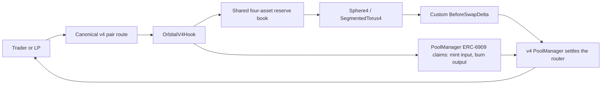
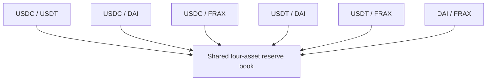
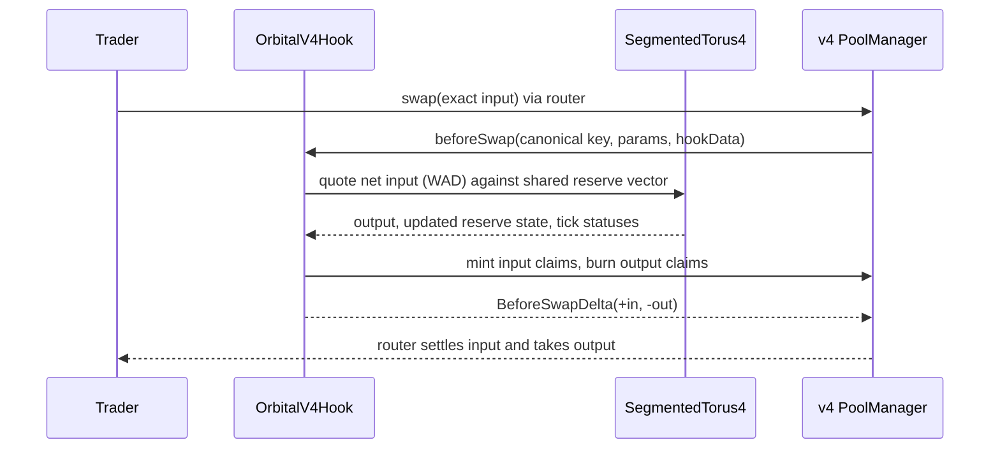

# Orbital

> **One reserve book for four stablecoins.**

Orbital is an experimental Uniswap v4 hook that applies bounded Orbital sphere and torus geometry to a shared stablecoin reserve book. In this prototype, USDC, USDT, DAI, and FRAX are represented by mock assets; their six canonical pair routes all advance the same four-asset state rather than splitting liquidity across six independent pools.

The project explores what concentrated multi-asset liquidity can look like when a pairwise swap is priced against one basket. It is not a production exchange, a deployed protocol, or a guarantee of stablecoin safety.

> [!WARNING]
> **Prototype only.** This repository is experimental, unaudited, and intended for mock/test environments. Swaps and range liquidity settle through a real Uniswap v4 PoolManager in tests and local deployments, but no verified public deployment is claimed until one is recorded below. Do not use it with real funds.

## The idea

Four stablecoins create six pair routes. In a conventional pair-per-pool design, each route can fragment capital from the others. Orbital instead exposes those routes through one logical reserve book: a USDC/DAI trade and a USDT/FRAX trade both affect the same aggregate state.

The implementation fixes the demo to four assets and uses bounded geometry. It supports exact-input routes, up to eight tick transitions per swap, per-range liquidity with fee checkpoints, and a Uniswap v4 hook that custodies the basket as PoolManager claims and settles every swap itself. It does **not** implement a general N-asset pool, a production router or position manager, all-boundary continuation, or an audited release.



## Mathematical model

Orbital is informed by Paradigm's Orbital research. The reference geometry permits an asset count `n >= 2`; the Solidity prototype deliberately fixes `n = 4`, where `sqrt(n) = 2` exactly in WAD arithmetic.

### Sphere branch

For normalized reserves `xᵢ` and a positive radius `r`, the nonnegative-price sphere branch is:

```text
Σ (r - xᵢ)² = r²,     0 ≤ xᵢ ≤ r
```

At the equal-price point, each four-asset coordinate is `q = r / 2`. The prototype normalizes token amounts to WAD, rejects overflow, rounds required inputs up, and rounds token payouts down. Normalization is accounting machinery—not a price oracle or a promise that an asset holds its peg.

### Tick planes and the aggregate torus

A tick is represented by a plane `α = k`, where `α = Σxᵢ / sqrt(n)`. Interior and boundary ranges combine into the fixed-partition aggregate invariant:

```text
(α_total - k_boundary - r_interior·sqrt(n))²
  + (||w|| - s_boundary)²
= r_interior²
```

`SegmentedTorus4` solves this bounded model by locating the next tick crossing, applying the partial transition, rebuilding the aggregate state, then continuing with remaining exact-input flow. The current implementation allows at most 16 configured ranges and 8 status transitions per swap; all-boundary continuation deliberately reverts rather than performing a partial settlement.

For derivations, rounding conventions, and unsupported branches, read the [protocol specification](docs/SPECIFICATION.md). The independent [Python reference guide](reference/README.md) describes the decimal model separately from Solidity's fixed-point implementation.

## What is implemented

| Capability | Current prototype behavior |
| --- | --- |
| Shared routing | Six canonical routes across USDC, USDT, DAI, and FRAX advance one logical reserve book. |
| Geometry | `Sphere4`, `Torus4`, and `SegmentedTorus4` provide bounded four-asset geometry, fixed-partition quotes, and tick trap/recovery transitions. |
| Swap domain | Canonical, exact-input pair swaps only; exact-output swaps are rejected. |
| v4 settlement | `beforeSwap` normalizes token decimals, charges a 0.05% input fee, prices the trade, mints input claims, burns output claims and returns the custom `BeforeSwapDelta`. Optional `hookData` carries `minAmountOut` and `deadline`. |
| Pool gating | `beforeInitialize` admits only the six canonical keys; `beforeAddLiquidity` rejects native v4 liquidity. |
| Range liquidity | `seed`, `addLiquidity`, `removeLiquidity` and `collectFees` move tokens through `PoolManager.unlock`. Shares and Q128 fee checkpoints live in `RangeFeeBook4`. |
| Solvency | `solvency()` compares held claims with rounded-up redeemable inventory plus unpaid fees; a fuzzed invariant keeps custody ≥ requirement. |
| Independent models | A Decimal Python reference and a dependency-free browser `BigInt` engine. Solidity, PoolManager settlement and the BigInt engine agree to the wei on shared vectors. |

### One basket, six routes



The pair interface chooses two assets from the basket; it does not own a separate liquidity allocation. Tests initialize all six pools on a real PoolManager and verify that a swap on any route moves only its two coordinates of the one shared book.

## Architecture and boundaries



The hook checks canonical currency ordering, pair membership, the configured hook, fee, tick spacing, and callback authorization before state mutation. Callbacks without a permission bit explicitly revert.

The following are intentionally outside the current implementation boundary:

- A production router or position manager (the demo uses v4-core's `PoolSwapTest`), and a wallet-connected frontend.
- Generic asset counts, exact-output swaps, single-token LP entry, fee-on-transfer tokens, and rebasing tokens.
- All-boundary continuation, a proven fixed-point error budget, fee-rate governance, pause authority, and audits.
- Any assurance that a stablecoin depeg is harmless or that LP capital is protected.

The fuller list of obligations and safety limits lives in [the specification](docs/SPECIFICATION.md#failure-policy-and-unresolved-obligations) and [release notes](docs/RELEASE.md).

## Quick start

### Requirements

- Foundry `v1.7.1`
- Python `3.14.6`
- Node.js, Git, and Make

Clone recursively so the pinned Uniswap v4-core dependency is available:

```sh
git clone --recurse-submodules https://github.com/Sarnav07/Orbital.git
cd Orbital
```

Run the complete local validation suite:

```sh
make check
```

This checks Solidity formatting, builds the contracts, reports bytecode sizes, runs the Foundry suite (unit, PoolManager integration, cross-language vectors, script and invariant tests), the independent Python reference tests, the simulator tests, and the app's tests, typecheck and production build.

Run the extended Foundry fuzz profile with:

```sh
cd contracts
FOUNDRY_PROFILE=ci forge test -vv
```

### Explore the frontend and simulator

The Vite/React interface presents the protocol narrative and a local, deterministic swap sandbox that uses the deployed demo parameters and fee. It does not connect a wallet or settle swaps on-chain.

```sh
cd app
npm install
npm run dev
```

The browser-native `BigInt` transition replayer and quote engine are available independently:

```sh
cd packages/simulator
npm test
```

See [`packages/simulator/README.md`](packages/simulator/README.md) for its scope and constraints.

### Deploy the frontend

The Vercel project is configured from the repository root because the React app imports the shared BigInt simulator and fixture packages:

```sh
npx vercel --prod
```

The root [`vercel.json`](vercel.json) installs and builds `app/`, publishes `app/dist`, and preserves the `/app` and `/docs` client-side routes.

Live frontend: [orbital-protocol-mu.vercel.app](https://orbital-protocol-mu.vercel.app)

### Deploy locally (anvil)

```sh
anvil &
cd contracts
PRIVATE_KEY=0xac0974bec39a17e36ba4a6b4d238ff944bacb478cbed5efcae784d7bf4f2ff80 \
POOL_MANAGER=0x0000000000000000000000000000000000000000 \
DEPLOYMENT_OUT=./deployments/anvil.json \
forge script script/DeployOrbitalDemo.s.sol --rpc-url http://127.0.0.1:8545 --broadcast
```

With `POOL_MANAGER` set to zero, the script deploys a fresh PoolManager. It then deploys four mock tokens (public `mint`), mines and deploys the hook through the CREATE2 factory, deploys a `PoolSwapTest` router, initializes all six pools, and seeds the three ranges. On a local run, a 1,000 USDT → USDC swap sent with `cast` returned 999.433404 USDC for 1,232,869 gas.

## Deployment posture

Unichain Sepolia (chain 1301) is the target network. Its official v4 PoolManager is `0x00b036b58a818b1bc34d502d3fe730db729e62ac`. Copy `.env.example` to `.env`, add a funded testnet key, then run the demo script with `--rpc-url $RPC_URL --broadcast`. Add `--verify` with the Unichain Sepolia explorer's verifier settings to publish source.

**No testnet deployment is recorded yet.** A deployment should not be described as live until this section lists the chain, transaction hashes, source commit, constructor inputs, deployed addresses (`contracts/deployments/unichain-sepolia.json`) and independently refreshed hook reads.

## References and attribution

- [Paradigm: Orbital](https://www.paradigm.xyz/writing/orbital) — mathematical inspiration for the sphere and tick-boundary model.
- [Uniswap v4-core](https://github.com/Uniswap/v4-core) — pinned interface dependency.

Project code is independently authored. Attribution does not imply code reuse, equivalence to, endorsement by, or affiliation with these projects.

## License

This project is licensed under the [MIT License](LICENSE).
