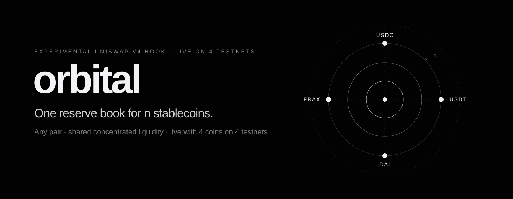
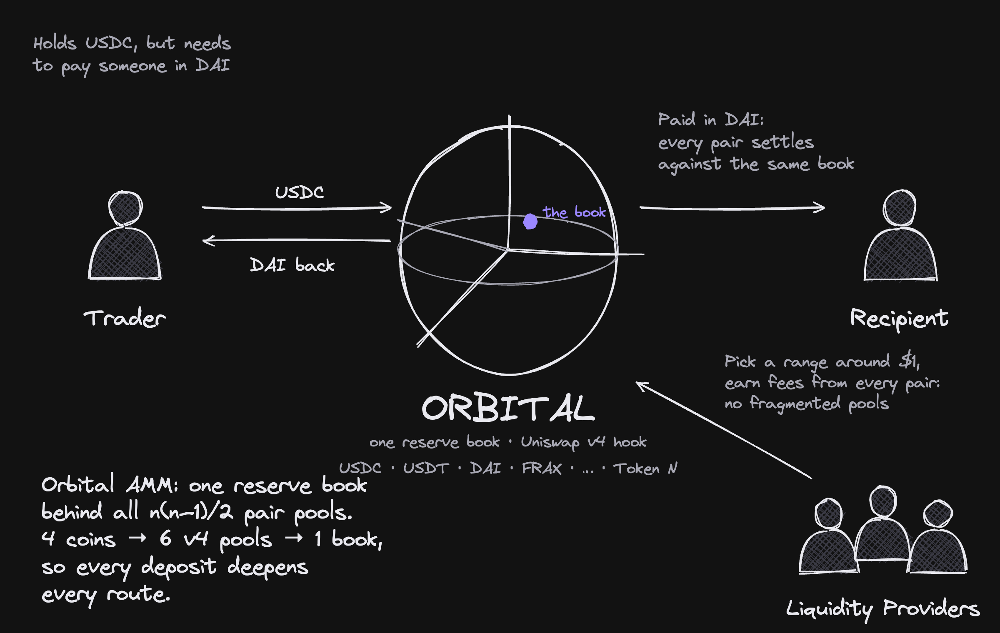
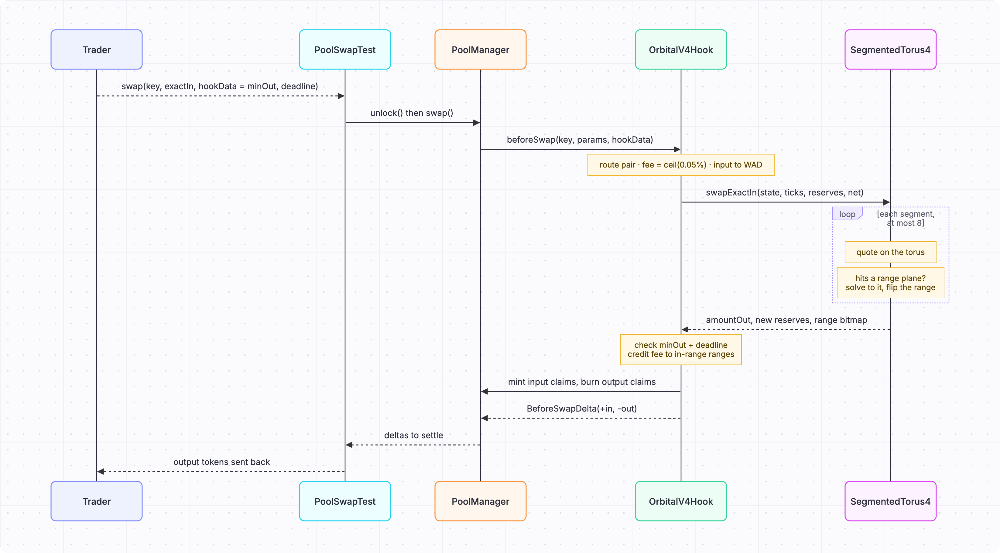
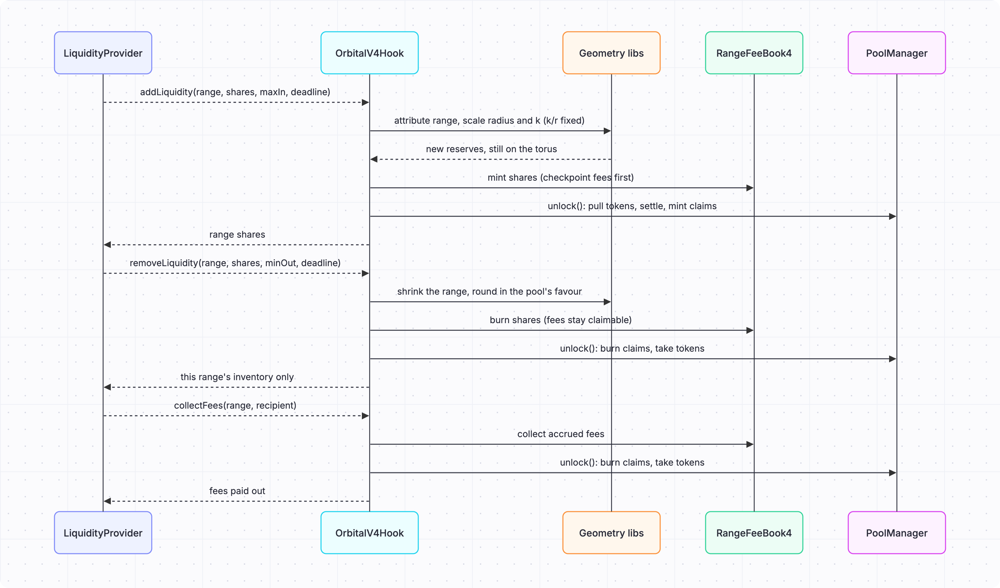
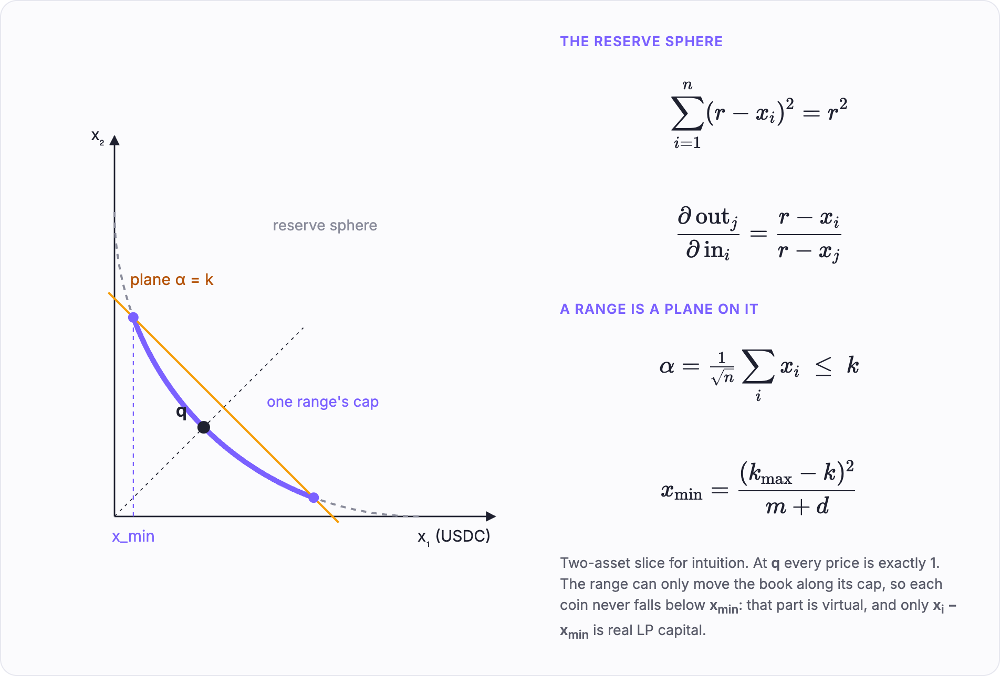
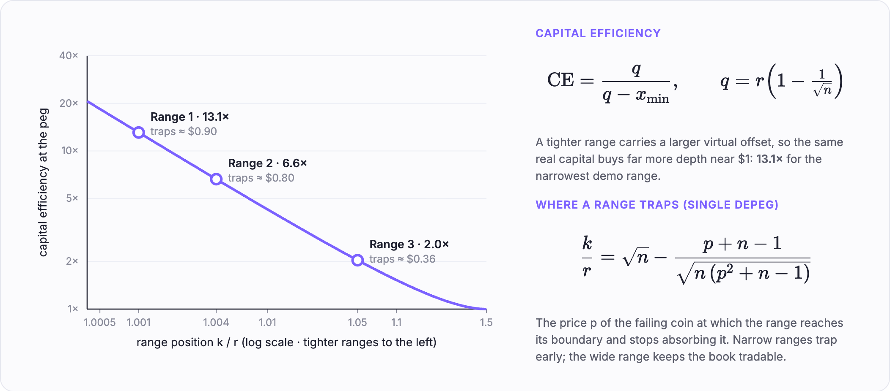
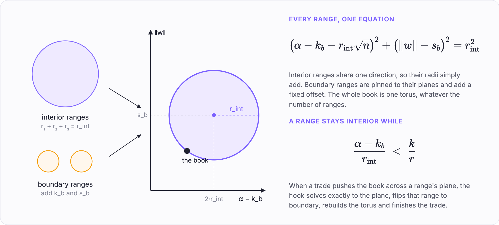

<div align="center">



### One Reserve Book for n Stablecoins, as a Uniswap v4 Hook

*Trade any stablecoin pair against one shared, concentrated reserve book. Let LPs choose how tightly they sit around the peg. Built on Paradigm's n-dimensional Orbital geometry.*

[](LICENSE)
[](https://docs.uniswap.org/contracts/v4/overview)
[](https://soliditylang.org/)
[](https://book.getfoundry.sh/)
[](https://viem.sh/)
[](#-live-demo--deployed-contracts)
[](https://orbital-protocol-mu.vercel.app/)

</div>

---

## 📋 Table of Contents

1. [Description](#-description)
2. [Overview](#-overview)
3. [Live Demo & Deployed Contracts](#-live-demo--deployed-contracts)
4. [Progress During the Hackathon](#-progress-during-the-hackathon)
5. [Architecture](#-architecture)
6. [The Mathematics: Spheres, Ticks and the Torus](#-the-mathematics-spheres-ticks-and-the-torus)
7. [Contract Interactions](#-contract-interactions)
8. [Technology Stack](#-technology-stack)
9. [Local Development & Deployment](#-local-development--deployment)
10. [Repository Structure](#-repository-structure)
11. [License](#-license)

---

## 📝 Description

Orbital is a stablecoin AMM built as a Uniswap v4 hook. Every stablecoin targets one dollar, yet AMMs trade them in pairs: n coins need n(n − 1)/2 separately funded pools, six for four coins and twenty-eight for eight. Depth sitting in USDC/USDT does nothing for a DAI/FRAX trade.

Orbital puts every coin in **one reserve book**. The six Uniswap v4 pair pools of the deployed 4-coin basket are only doors into it: a USDC→DAI trade and a USDT→FRAX trade move the same n-asset reserve vector. Liquidity providers don't deposit into a pair; they pick a **range**, a boundary plane on an n-dimensional sphere that decides how tightly their capital concentrates around the peg, and how much depeg risk they carry.

The hard part is the geometry. Pricing a swap means solving a sphere-and-torus invariant in n dimensions, detecting when a range reaches its boundary, and continuing the trade across that crossing, all on-chain in 18-decimal fixed point. Orbital does this inside `beforeSwap`, holds the whole basket as PoolManager ERC-6909 claims, and settles every trade through the real v4 PoolManager.

<div align="center">

<br/>
<sub><i>One book behind every pair. Traders swap any coin for any other; LPs choose a range around &#36;1 and earn fees from every pool.</i></sub>
</div>

---

## 🌟 Overview

**Orbital** implements Paradigm's [Orbital](https://www.paradigm.xyz/writing/orbital) design as a Uniswap v4 hook, live on **Unichain Sepolia, Ethereum Sepolia, Arbitrum Sepolia and Arc Testnet**. It addresses three problems with how stablecoins are traded today.

### 1. **Fragmented Liquidity**
Pair-based AMMs split a basket into n(n − 1)/2 pools, each funded on its own; adding a coin adds n − 1 empty pools. **Orbital keeps one n-asset reserve vector behind every pair**, so every deposit deepens every route.

### 2. **Flat, or Two-Token-Only, Concentration**
Curve-style StableSwap spreads depth across prices a stablecoin rarely reaches, and Uniswap v3 concentrates only two tokens at a time. **Orbital concentrates n tokens at once**: an LP's range is a plane cutting the reserve sphere, and a tighter range buys many times the depth near the peg.

### 3. **Fragile Under Depegs**
A flat pool keeps quoting a failing coin near &#36;1, so its LPs end up holding it. **In Orbital a range stops trading at its boundary.** The narrow demo ranges trap near &#36;0.90 and &#36;0.80 while the wide range keeps the book tradable.

---

### 🎯 Key Innovations

-  **One shared reserve book.** Six v4 pair pools, one n-asset reserve vector: every route moves the same state and draws on the same depth.
-  **Sphere invariant.** Reserves live on one n-dimensional sphere; at its centre every pair trades 1:1, and the curve bends only as the basket leaves the peg.
- **Ranges as planes.** Each LP range is a plane `α = k` on the sphere; `k/r` sets its concentration (13.1×, 6.6× and 2.0× capital efficiency in the demo).
-  **Torus consolidation.** Interior ranges combine into one sphere and boundary ranges add a fixed offset: the whole book is a single torus, whatever the number of ranges.
-  **Crossing-aware engine.** A swap is split at every range boundary it crosses (up to 8 segments), flipping ranges between in-range and boundary mid-trade.
-  **Range-local LP claims.** LP shares claim only their own range's inventory; fees are split across in-range ranges with Q128 per-share checkpoints.
-  **PoolManager custody.** The hook holds the basket as ERC-6909 claims and settles by minting input and burning output claims inside one `unlock`.
-  **Wei-exact everywhere.** The Solidity engine, settlement through a real PoolManager and the browser's BigInt engine agree to the wei on a shared vector file.

---

## 🌐 Live Demo & Deployed Contracts

### **Try Orbital Now**

🚀 **Live Application:** [https://orbital-three-delta.vercel.app/](https://orbital-three-delta.vercel.app/) · [Launch app](https://orbital-three-delta.vercel.app/) · [Protocol guide](https://orbital-three-delta.vercel.app//docs)

**Networks:** Unichain Sepolia (featured) · Ethereum Sepolia · Arbitrum Sepolia · Arc Testnet

### **Quick Start Guide**

1. **Get testnet gas:** ETH on Unichain / Ethereum / Arbitrum Sepolia, or USDC on Arc ([faucet.circle.com](https://faucet.circle.com/)).
2. **Connect a wallet:** any injected browser wallet (MetaMask, Rabby, Coinbase Wallet), then pick a network in the nav.
3. **Mint test tokens:** open your account drawer and mint 10,000 of each mock stablecoin.
4. **Swap:** trade any pair; the quote is exact, and your minimum output and deadline are enforced on-chain.
5. **Add liquidity:** open a pool from **Pools**, choose a range and deposit; collect its fees any time.
6. **Explore the model:** the **Sandbox** runs the same BigInt engine locally, including a depeg stress test.

---

### **Deployed Smart Contracts**

The same four-coin pool runs on **four testnets**, each with its own hook, router and mock basket, all seeded with about 3.59M of each coin. Every hook and fee book is source-verified (Blockscout on Unichain Sepolia, exact matches on [Sourcify](https://sourcify.dev) elsewhere).

| Network | Chain ID | Gas | OrbitalV4Hook | PoolManager | Live swap | Manifest |
| --- | --- | --- | --- | --- | --- | --- |
| **Unichain Sepolia** | `1301` | ETH | [0x5fe2…A888](https://unichain-sepolia.blockscout.com/address/0x5fe242b3544Dd0d30C395843dE75A2B8d4dBA888) | [0x00B0…62AC](https://unichain-sepolia.blockscout.com/address/0x00B036B58a818B1BC34d502D3fE730Db729e62AC) | [0x59f6dfa9…](https://unichain-sepolia.blockscout.com/tx/0x59f6dfa946fe47b2e008c5b376af9d389113f1e298df6dcd568afea3b8d840b2) | [unichain-sepolia.json](contracts/deployments/unichain-sepolia.json) |
| **Ethereum Sepolia** | `11155111` | ETH | [0x1140…6888](https://sepolia.etherscan.io/address/0x1140236A2d35b328f38F9eF8Bee3C781F0fA6888) | [0xE03A…3543](https://sepolia.etherscan.io/address/0xE03A1074c86CFeDd5C142C4F04F1a1536e203543) | [0xc6cecb15…](https://sepolia.etherscan.io/tx/0xc6cecb151a8e4545b5062c6a3f928c62dc994e35a73ff34acae1fd79bbdd61ea) | [sepolia.json](contracts/deployments/sepolia.json) |
| **Arbitrum Sepolia** | `421614` | ETH | [0x39Fb…6888](https://sepolia.arbiscan.io/address/0x39Fb6DC7EF95c33FBDa2c8B2ED90f8E069736888) | [0xFB3e…a317](https://sepolia.arbiscan.io/address/0xFB3e0C6F74eB1a21CC1Da29aeC80D2Dfe6C9a317) | [0xb2fcf6df…](https://sepolia.arbiscan.io/tx/0xb2fcf6df2c5672065bfc55a73a0810414f4c08851c739ce665990f32207a94dc) | [arbitrum-sepolia.json](contracts/deployments/arbitrum-sepolia.json) |
| **Arc Testnet** | `5042002` | USDC | [0xb2e4…E888](https://explorer.testnet.arc.io/address/0xb2e429bC1E7184F717a1dfEEd34F72FCA130E888) | [0x8366…0951](https://explorer.testnet.arc.io/address/0x8366a39CC670B4001A1121B8F6A443A643e40951) | [0xdb6a6c55…](https://explorer.testnet.arc.io/tx/0xdb6a6c5571b9080a900eca371e95391d926c5a2158c7774a9bc3d64f8b55ed97) | [arc-testnet.json](contracts/deployments/arc-testnet.json) |

**Unichain Sepolia tokens** (import into MetaMask; mock assets with a public `mint`, no value):

```text
USDC  0xFc82C77256e74289f1B70f14126d21550C495a33   6 decimals
USDT  0x4eBEa178D6a3F18C166cb8C5b67BA73dBCD26b4A   6 decimals
DAI   0xD3c22D959fE356a4C0AA6B2e3A8B2C6cf04F2Aae  18 decimals
FRAX  0x68400C108461BD3D6F2124D6B81127D5f2c1EF65  18 decimals
```

<details>
<summary><b>Unichain Sepolia deployment evidence</b></summary>
<br/>

- **OrbitalV4Hook** [`0x5fe242b3544Dd0d30C395843dE75A2B8d4dBA888`](https://unichain-sepolia.blockscout.com/address/0x5fe242b3544Dd0d30C395843dE75A2B8d4dBA888) · **RangeFeeBook4** [`0xCB8822F09717e40F340183DDE97e544b4A2c7ae1`](https://unichain-sepolia.blockscout.com/address/0xCB8822F09717e40F340183DDE97e544b4A2c7ae1)
- **Swap router** (v4-core `PoolSwapTest`) [`0x9EA2eB21BcF6178f1982d94181f6bc88A614dA42`](https://unichain-sepolia.blockscout.com/address/0x9EA2eB21BcF6178f1982d94181f6bc88A614dA42) · **PoolManager** (official Uniswap v4) [`0x00B036B58a818B1BC34d502D3fE730Db729e62AC`](https://unichain-sepolia.blockscout.com/address/0x00B036B58a818B1BC34d502D3fE730Db729e62AC)
- **Hook deployment** (CREATE2 factory, 5,514,456 gas): [`0xa65fc58f…64bc9`](https://unichain-sepolia.blockscout.com/tx/0xa65fc58ffbd5ceef62f67c98caedc687c56fe7c7df394e396515070f62a64bc9)
- **Range seeding** (3.59M of each asset as PoolManager claims): [`0xdfb39755…1ffa0`](https://unichain-sepolia.blockscout.com/tx/0xdfb3975585b086827ebf8cd4c7383b62cc5c0b0a35dec4eea92dcf911fb1ffa0)
- **Live swap:** 1,000 USDC → exactly 999.433404420670936920 DAI, 0.5 USDC fee, with `minAmountOut` and a deadline (1,235,447 gas): [`0x59f6dfa9…840b2`](https://unichain-sepolia.blockscout.com/tx/0x59f6dfa946fe47b2e008c5b376af9d389113f1e298df6dcd568afea3b8d840b2)
- **Constructor inputs:** 15,000,000 WAD reserves per asset; three 10M-WAD ranges at k/r 1.001 / 1.004 / 1.05; fee 500; tick spacing 60.
- **History:** redeployed on 2026-09-26 after an internal security review; tokens, router and PoolManager were kept, and the previous hook is recorded under `supersedes` in each [manifest](contracts/deployments).
- **Arc's PoolManager** runs code byte-identical to Uniswap's v4 PoolManager but has a different owner, so it can't be proven to be Uniswap's own deployment. That owner can only enable protocol fees, which don't apply: the hook consumes every swap, so the core pool never trades.

</details>

---

## 🛠️ Progress During the Hackathon

We started from Paradigm's Orbital paper and one question: can n stablecoins really share one reserve book behind all of their pair pools, with the full geometry priced on-chain?

We did the math first, because it was the risky part. An independent Python model in 80-digit `Decimal` pins down the sphere, the tick planes, the torus and the crossing rules for any n. The Solidity engine was then written against it in 18-decimal fixed point: `Sphere4` for per-range geometry, `Torus4` for the consolidated invariant and its bounded solver, and `SegmentedTorus4` for trades that cross range boundaries. The deployed hook fixes n = 4, so √n = 2 is exact in WAD.

On top of the engine we built the Uniswap v4 layer. `OrbitalV4Hook` admits only the six canonical pair pools, rejects native v4 liquidity, prices each exact-input swap in `beforeSwap`, and settles it with a custom `BeforeSwapDelta` against claims it holds in the PoolManager. LPs enter and leave ranges through the hook, and `RangeFeeBook4` tracks their shares and fees per range.

For the app, a dependency-free BigInt port of the engine runs in the browser, so every quote is an exact mirror of what the hook pays. The Uniswap-style interface swaps, provides range liquidity and reads the book live on any of the four networks, and the Sandbox shows ranges trapping as a coin depegs.

Before submission we ran an internal line-by-line security review. It found a real bug: a trade ending exactly on a range's boundary could leave that range trading past its bound and freeze LP withdrawals. We proved it with failing tests, fixed it in Solidity, JavaScript and Python together, then redeployed and source-verified the fixed hook on all four networks.

A few things are deliberately rough, and we would rather say so. The router is v4-core's `PoolSwapTest`, the tokens are mocks, there's no pause or fee governance, a trade that would trap every range reverts, and the code has not had a professional audit.

---

## 🏗️ Architecture

Orbital separates **pure geometry** (stateless Solidity libraries) from the **v4 adapter and custodian** (the hook), and mirrors the geometry exactly in a BigInt engine that the app and tests share.

---

### 5.1 System Overview

```
┌─────────────────────────────────────────────────────────────────┐
│                          FRONTEND                               │
│   React 19 • Vite • viem • BigInt engine (packages/simulator)   │
│   Landing · Docs · Swap · Pools · Explore · Sandbox             │
└──────────────┬───────────────────────────────┬──────────────────┘
               │ reads (public RPC)            │ writes (wallet)
               ▼                               ▼
┌─────────────────────────────────────────────────────────────────┐
│           UNICHAIN · ETHEREUM · ARBITRUM SEPOLIA · ARC          │
│                                                                 │
│   PoolSwapTest router ──► Uniswap v4 PoolManager                │
│                           (6 pair pools, ERC-6909 custody)      │
│                                  │  beforeSwap / unlock         │
│                                  ▼                              │
│   ┌──────────────────────────────────────────────────────────┐  │
│   │  OrbitalV4Hook  (one n-asset reserve book)               │  │
│   │    ├─ SegmentedTorus4  → Torus4 → Sphere4  (pricing)     │  │
│   │    ├─ RangeLiquidity4  (per-range inventory)             │  │
│   │    ├─ TokenUnits · FixedPointMath  (decimals, WAD)       │  │
│   │    └─ RangeFeeBook4  (range shares, Q128 fee growth)     │  │
│   └──────────────────────────────────────────────────────────┘  │
└─────────────────────────────────────────────────────────────────┘
```

---

### 5.2 Contract Stack

- **`OrbitalV4Hook`** (Solidity): the v4 hook and custodian. It admits the canonical pools, prices swaps in `beforeSwap`, settles through PoolManager claims, and runs range liquidity.
- **`SegmentedTorus4`** (library): crossing-aware exact-input engine; splits a trade at each range boundary (≤ 8 segments) and flips range status.
- **`Torus4`** (library): the consolidated torus invariant and a fixed-partition quote solver (scan + bisection, 1e-9 acceptance rule).
- **`Sphere4`** (library): per-range sphere geometry (boundary radius, virtual offset, capital efficiency).
- **`RangeLiquidity4`** (library): reconstructs each range's coordinates and redeemable inventory from the shared book.
- **`RangeFeeBook4`** (Solidity): per-range LP shares with Q128 fee-growth checkpoints, created and controlled by the hook.
- **`TokenUnits` · `FixedPointMath`** (libraries): exact decimal ↔ WAD conversion and a 512-bit `mulDiv`.
- **`HookAddressMiner`** (library): mines the CREATE2 salt so the hook address carries its permission flags.
- **`PoolManager` · `PoolSwapTest`** (Uniswap v4-core): canonical custody and settlement, and the demo router.

**Hook permissions.** v4 reads them from the low 14 bits of the hook's address, so every deployed Orbital hook ends in the flag pattern **`0x2888`**:

```text
beforeInitialize       1 << 13   admit only the six canonical pair keys (fee 500, spacing 60, this hook)
beforeAddLiquidity     1 << 11   always revert: liquidity goes through the hook's range functions
beforeSwap             1 << 7    fee on input, price across up to 8 crossings, mint/burn claims
beforeSwapReturnDelta  1 << 3    return BeforeSwapDelta(+in, −out): the hook's curve replaces the pool's
```

<div align="center">

<br/>
<sub><i>Two trades on two different v4 pools move the <b>same</b> reserve vector. That is the whole idea: the pools are doors, the book is shared.</i></sub>
</div>

---

### 5.3 Core Workflows

#### **5.3.1 Swapping**

<div align="center">

</div>

**Key insight:** the core v4 pool never trades. The hook consumes the whole input in `beforeSwap`, so every pair pool is only an entry point into the same book. Your minimum output and deadline travel in `hookData` and are enforced on-chain.

#### **5.3.2 Providing Liquidity**

<div align="center">

</div>

**Range-local claims:** an LP buys shares of one range at that range's current basket, and withdrawals return only that range's inventory. An LP in a narrow range never pays for a wide range's depeg exposure, and vice versa.

---

## 🔢 The Mathematics: Spheres, Ticks and the Torus

Orbital follows Paradigm's [Orbital paper](https://www.paradigm.xyz/writing/orbital). The figures below are our own renderings of its geometry, restated for this implementation. The Python reference supports any n; the deployed hook fixes **n = 4**.

---

### 6.1 The Sphere and the Ranges on It

<div align="center">

</div>

Reserves $x_1, \dots, x_n$ live on the sphere $\sum_i (r - x_i)^2 = r^2$. At the equal-price point every coin holds $q = r\left(1 - \frac{1}{\sqrt{n}}\right)$, and the instantaneous price of coin $j$ in coin $i$ is $\frac{r - x_i}{r - x_j}$, so every pair trades 1:1 at the centre.

With $\alpha = \frac{1}{\sqrt{n}} \sum_i x_i$, a range is the cap $\alpha \le k$, bounded by the plane $\alpha = k$, where $r(\sqrt{n} - 1) \le k \le \frac{r(n-1)}{\sqrt{n}}$. The plane cuts the sphere in a circle of radius $s$, and no coin of the range can fall below its **virtual offset**:

```math
s^2 = (k - k_{\min})\big(2r - (k - k_{\min})\big), \qquad x_{\min} = \frac{(k_{\max} - k)^2}{m + d}, \quad m = \frac{k}{\sqrt{n}},\ d = \sqrt{\tfrac{n-1}{n}}\,s
```

Only $x_i - x_{\min}$ is real LP capital.

---

### 6.2 Capital Efficiency and Where Ranges Trap

<div align="center">

</div>

A tighter range carries a larger virtual offset, so the same real capital buys far more depth at the peg: $\text{CE} = \frac{q}{q - x_{\min}}$. In a single-depeg scenario a range reaches its boundary when the failing coin's price $p$ satisfies $\frac{k}{r} = \sqrt{n} - \frac{p + n - 1}{\sqrt{n(p^2 + n - 1)}}$. That gives the demo ranges **13.1× / 6.6× / 2.0×** efficiency and trap prices near **&#36;0.90 / &#36;0.80 / &#36;0.36**.

---

### 6.3 Consolidation: One Torus

<div align="center">

</div>

Interior ranges share one direction, so their radii add into $r_{\text{int}}$. Boundary ranges are pinned to their planes and add their $k$ and $s$ into $k_b$ and $s_b$. With $\lVert w \rVert$ the spread of reserves around their mean, the whole book satisfies

```math
\left(\alpha - k_b - r_{\text{int}}\sqrt{n}\right)^2 + \left(\lVert w \rVert - s_b\right)^2 = r_{\text{int}}^2
```

`Torus4` evaluates this residual and accepts a state when $|\text{residual}| / r_{\text{int}}^2 \le 10^{-9}$.

---

### 6.4 Crossing a Boundary

<div align="center">

<br/>
<sub><i>A coin depegs and recovers. Each range turns to <b>Boundary</b> at its own trap price and comes back when the price returns, while the wide range keeps trading.</i></sub>
</div>

A range stays in range exactly while $\frac{\alpha - k_b}{r_{\text{int}}} < \frac{k}{r}$. A rising projection traps the nearest interior range, and a falling one recovers the nearest boundary range. At the crossover the reserve sum is fixed at $2(r_{\text{int}}\lambda + k_b)$ for $n = 4$, which fixes input − output and reduces the crossing to **one scalar root**, bracketed and bisected. A range already sitting on its plane when a trade starts flips first, with no trade.

---

### 6.5 Fees, Rounding and Solvency

```math
\text{fee} = \left\lceil \frac{\text{amountIn}_{\text{raw}} \cdot 500}{10^6} \right\rceil, \qquad \text{net}_{\text{WAD}} = (\text{amountIn}_{\text{raw}} - \text{fee}) \cdot 10^{18 - d_{\text{in}}}, \qquad \text{out}_{\text{raw}} = \left\lfloor \frac{\text{out}_{\text{WAD}}}{10^{18 - d_{\text{out}}}} \right\rfloor
```

The 0.05% fee is split across the ranges that were in range when the swap started, weighted by radius, with Q128 per-share growth. Inputs round up, payouts round down, and liquidity changes round in the pool's favour, so at every settled state the hook's claims cover every range's redeemable inventory plus unpaid fees:

```math
\text{claims}_i \;\ge\; \left\lceil \frac{\text{reserve}_i - \sum_{\text{ranges}} x_{\min}}{10^{18 - d_i}} \right\rceil + \text{unpaidFees}_i
```

This is checked by fuzzed invariant campaigns over random swaps, deposits, withdrawals and fee collection.

---

### 6.6 Fixed-Point Implementation

- **Exactness:** n = 4, so $\sqrt{n} = 2$ is exact in WAD ($10^{18}$); square roots are floored.
- **Solver:** a 48-interval scan, then up to 96 bisection steps; the endpoint with the smaller residual wins.
- **Bounded work:** at most 16 ranges and 8 crossing segments per swap.
- **Measured gas** (full swaps through a real PoolManager and router): **~1.22M** for an ordinary swap, **~3.15M** trapping one range, **~4.81M** trapping two; **~332k** to add and **~178k** to remove 1% of a range.

---

## 🔗 Contract Interactions

### 7.1 OrbitalV4Hook

```solidity
// ── Liquidity ──────────────────────────────────────────────────────
// One-time funding of the configured ranges by the owner.
function seed(address recipient) external returns (uint256[4] memory amounts);

// Mint `shares` of one range by depositing that range's current basket.
function addLiquidity(uint256 rangeId, uint256 shares, uint256[4] calldata maxAmountsIn, uint256 deadline)
    external returns (uint256[4] memory amounts);

// Burn `shares` of one range and withdraw only that range's real inventory.
function removeLiquidity(uint256 rangeId, uint256 shares, uint256[4] calldata minAmountsOut, uint256 deadline)
    external returns (uint256[4] memory amounts);

// Pay the caller's accrued swap fees for one range to `recipient`.
function collectFees(uint256 rangeId, address recipient) external returns (uint256[4] memory amounts);

// ── Previews and state ─────────────────────────────────────────────
function previewAddLiquidity(uint256 rangeId, uint256 shares) external view returns (uint256[4] memory);
function previewRemoveLiquidity(uint256 rangeId, uint256 shares) external view returns (uint256[4] memory);
function reserves() external view returns (uint256[4] memory);            // WAD coordinates of the shared book
function solvency() external view returns (uint256[4] memory custody, uint256[4] memory required);
function feeLiability() external view returns (uint256[4] memory);        // unpaid fees per coin
function tickAt(uint256 index) external view returns (SegmentedTorus4.Tick memory); // radius, k, isInterior
function sharesOf(uint256 rangeId, address provider) external view returns (uint256);
function rangeAttributions() external view returns (RangeLiquidity4.Attribution[] memory);
```

**Units:** reserves and range geometry are WAD (`1e18` = 1.0); token amounts in and out are raw token units; coins are indexed in sorted address order.

### 7.2 Swapping Through the Router

Swaps are ordinary v4 swaps on one of the six pair pools; the hook does the pricing.

```solidity
PoolKey memory key = PoolKey({
    currency0: lowerAddress,           // the two coins, sorted
    currency1: higherAddress,
    fee: 500,                          // 0.05%
    tickSpacing: 60,
    hooks: IHooks(orbitalHook)
});

router.swap(
    key,
    SwapParams({ zeroForOne: sellingCurrency0, amountSpecified: -int256(amountIn), sqrtPriceLimitX96: limit }),
    PoolSwapTest.TestSettings({ takeClaims: false, settleUsingBurn: false }),
    abi.encode(minAmountOut, deadline) // enforced by the hook; empty hookData means no guard
);
```

Only exact-input swaps are accepted. The hook ignores `sqrtPriceLimitX96`; `minAmountOut` in `hookData` is the price guard.

---

## 🚀 Technology Stack

**Smart contracts**
- Solidity 0.8.30 (`via_ir`, Cancun) and Foundry 1.7.1 for build, unit, fuzz and invariant tests, and deploy scripts
- Uniswap v4-core (pinned submodule): PoolManager, `PoolSwapTest`, hook interfaces
- solmate `MockERC20` for the mock USDC, USDT, DAI and FRAX

** Frontend**
- React 19, TypeScript 7, Vite 8, motion for animation
- viem 2.56 with EIP-6963 injected-wallet discovery
- The BigInt engine from `packages/simulator`, an exact mirror of `beforeSwap`, for quotes
- Hosted on Vercel

** Verification**
- An independent Python 3.14 `Decimal` reference model
- A shared vector file asserted to the wei in Solidity, through the PoolManager, and in JavaScript
- **74** Solidity tests (including 2 invariant campaigns), **32** Python, **13** simulator, **102** app and **4** end-to-end
- Slither, `forge lint` and `forge fmt`; GitHub Actions runs every suite plus an end-to-end run against anvil

** Networks**
- **Unichain Sepolia** (1301, ETH gas) · [Blockscout](https://unichain-sepolia.blockscout.com)
- **Ethereum Sepolia** (11155111, ETH gas) · [Etherscan](https://sepolia.etherscan.io)
- **Arbitrum Sepolia** (421614, ETH gas) · [Arbiscan](https://sepolia.arbiscan.io)
- **Arc Testnet** (5042002, USDC gas) · [Arc Explorer](https://explorer.testnet.arc.io)

---

## 🛠️ Local Development & Deployment

### 9.1 Prerequisites

- **Foundry** 1.7.1 (`forge`, `cast`, `anvil`)
- **Node.js** 22+
- **Python** 3.14.6
- **Make** and **jq** (for the end-to-end run)

### 9.2 Installation

```bash
git clone --recurse-submodules https://github.com/Sarnav07/Orbital.git
cd Orbital
```

### 9.3 Running Every Check

```bash
make check    # Foundry fmt/build/tests, Python reference, simulator, app tests, typecheck, build
```

### 9.4 Running the App

```bash
cd app
npm install
npm run dev   # http://localhost:5173/app
```

The app reads the live deployments over public RPCs; no API keys are needed.

### 9.5 Testing

```bash
make app-e2e                                                              # deploy to a throwaway anvil node, drive it with the app's own transaction builders
cd contracts && FOUNDRY_PROFILE=ci forge test                             # 4,096 fuzz runs, deeper invariant campaigns
cd app && ORBITAL_LIVE=1 npx vitest run src/chain/live.testnet.test.ts    # read-only checks against all four live deployments
```

### 9.6 Deploying

```bash
cp .env.example .env            # add a funded testnet key; never commit .env
set -a && . ./.env && set +a
cd contracts && forge build

# Fresh demo: mock tokens, hook, six pools, seeded ranges, router.
# POOL_MANAGER=0x0…0 on anvil deploys its own PoolManager.
forge script script/DeployOrbitalDemo.s.sol --rpc-url $RPC_URL --broadcast

# Replace only the hook on a network that already runs the demo
# (set POOL_MANAGER, ROUTER, USDC, USDT, DAI, FRAX).
forge script script/RedeployOrbitalHook.s.sol --rpc-url $RPC_URL --broadcast
```

Set `DEPLOYMENT_OUT=./deployments/<network>.json` to write the deployment manifest.

---


## 📄 License

This project is licensed under the **MIT License**. See [LICENSE](LICENSE).

---

## Acknowledgments

- **Dan Robinson, Ciamac Moallemi and Dave White (Paradigm)** for the [Orbital](https://www.paradigm.xyz/writing/orbital) research this project implements
- **Uniswap Labs** for [v4-core](https://github.com/Uniswap/v4-core) and the hooks architecture

---

## 🔗 Resources

- **Orbital paper:** [https://www.paradigm.xyz/writing/orbital](https://www.paradigm.xyz/writing/orbital)
- **Uniswap v4 docs:** [https://docs.uniswap.org/contracts/v4/overview](https://docs.uniswap.org/contracts/v4/overview)
- **Live app:** [https://orbital-three-delta.vercel.app/](https://orbital-three-delta.vercel.app/)
- **Protocol guide:** [https://orbital-three-delta.vercel.app/docs](https://orbital-three-delta.vercel.app/docs)
- **Repository:** [https://github.com/Sarnav07/Orbital](https://github.com/Sarnav07/Orbital)

---

**Experimental testnet software on mock tokens. Not professionally audited.**
